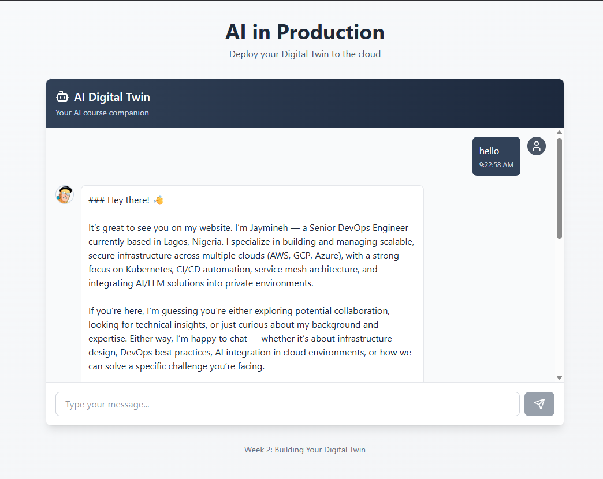
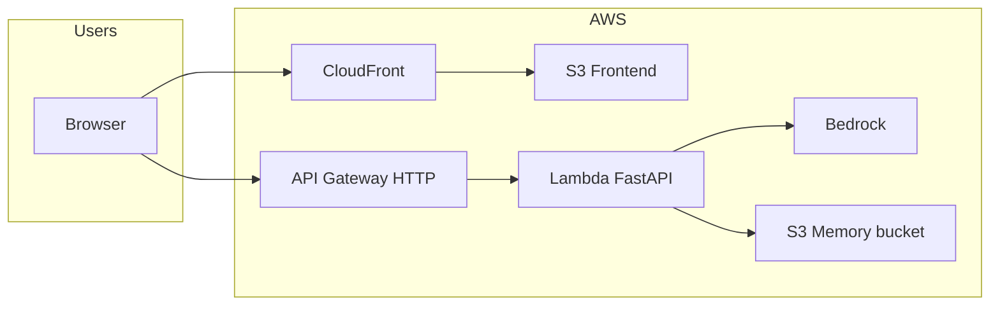

# Digital Twin

A small full-stack “digital twin” app: a **Next.js** static frontend on **S3 + CloudFront**, a **FastAPI** API packaged for **AWS Lambda** behind **API Gateway (HTTP)**, with **Amazon Bedrock** for chat and **S3** for optional conversation memory. Infrastructure is defined in **Terraform** and can be deployed from your machine or **GitHub Actions**.

Step-by-step course material (OIDC, state backend, domain options, and more) lives in [`tutorial/`](tutorial/) (for example [`tutorial/day5.md`](tutorial/day5.md) for CI and remote state).

---

## Screenshot

The app in production after deploy (static site on CloudFront, API on API Gateway + Lambda + Bedrock):



---

## Architecture



- **Frontend**: Next.js with `output: 'export'` → static files synced to the frontend S3 bucket; users hit the **CloudFront** URL.
- **Backend**: Lambda runs the same FastAPI app as local dev (via **Mangum**); **API Gateway** exposes `GET /`, `POST /chat`, `GET /health`.
- **Terraform** uses an **S3 remote backend** and **DynamoDB** locking so CI and laptops share state per environment workspace (`dev` / `test` / `prod`).

---

## Repository layout

| Path | Purpose |
|------|--------|
| [`backend/`](backend/) | FastAPI app (`server.py`), Lambda entrypoint (`lambda_handler.py`), persona data under `backend/data/`, `deploy.py` builds `lambda-deployment.zip` |
| [`frontend/`](frontend/) | Next.js UI; production build writes to `frontend/out/` |
| [`terraform/`](terraform/) | AWS resources: S3, CloudFront, Lambda, API Gateway, IAM, optional Route53/ACM when using a custom domain |
| [`scripts/deploy.sh`](scripts/deploy.sh) | Build Lambda zip → `terraform init/apply` → build frontend → `aws s3 sync` to frontend bucket |
| [`scripts/destroy.sh`](scripts/destroy.sh) | Empty app buckets → `terraform destroy` for the selected workspace |
| [`.github/workflows/`](.github/workflows/) | `deploy.yml` (push to `main` or manual) and `destroy.yml` (manual, with confirmation) |
| [`tutorial/`](tutorial/) | Day-by-day writeups that match how this stack was set up |

---

## Prerequisites

### For local deploys and Terraform

- **AWS CLI** configured (`aws configure` or environment variables) with permissions to manage the resources in `terraform/main.tf`
- **Terraform** `>= 1.0`
- **[uv](https://docs.astral.sh/uv/)** (Python 3.12+)
- **Node.js 20+** and npm
- **Docker** — required for [`backend/deploy.py`](backend/deploy.py), which installs Lambda dependencies inside the official `public.ecr.aws/lambda/python:3.12` image (matches CI)

### For GitHub Actions

- AWS account with **OIDC** trust to GitHub and an IAM role the workflow can assume (walkthrough: [`tutorial/day5.md`](tutorial/day5.md))
- Repository **secrets** (see below)
- Optional **GitHub Environments** named `dev`, `test`, `prod` if you use environment protection rules

### For Bedrock

- In the AWS console, enable access to the **Bedrock** model you set in `bedrock_model_id` (see [`terraform/terraform.tfvars`](terraform/terraform.tfvars) or override in `prod.tfvars`).

---

## One-time AWS setup

### 1. Terraform state bucket and lock table

Scripts expect:

- S3 bucket: `twin-terraform-state-<YOUR_AWS_ACCOUNT_ID>`
- DynamoDB table: `twin-terraform-locks` (partition key `LockID`, string)

Create these once per account. The repo does **not** commit a `backend-setup.tf`; follow **Part 3** in [`tutorial/day5.md`](tutorial/day5.md) (temporary Terraform file, targeted apply, then remove the file), or create equivalent resources in the console.

`terraform/versions.tf` must contain a `backend "s3" {}` block so `terraform init -backend-config=...` from [`scripts/deploy.sh`](scripts/deploy.sh) actually uses remote state (not a fresh local state each run).

### 2. S3 “Block Public Access” and the frontend bucket policy

The stack attaches a **public read** bucket policy to the **frontend** website bucket (`Principal: "*"`, `s3:GetObject`). Some accounts block that at the **account** level. If `PutBucketPolicy` returns 403, either adjust account/org **Block Public Access** policy for this use case or change the Terraform pattern (e.g. private bucket + CloudFront Origin Access Control). The tutorial discusses the tradeoffs in context.

---

## Configuration

### Root `.env.example`

Copy to `.env` (or export in your shell) for **local** tooling; values are also passed in GitHub Actions via secrets.

| Variable | Used for |
|----------|-----------|
| `AWS_ACCOUNT_ID` | Documentation / consistency; deploy script resolves account via `aws sts get-caller-identity` |
| `DEFAULT_AWS_REGION` | Backend region, Terraform backend `region`, and resource region |
| `PROJECT_NAME` | Terraform `project_name` (default `twin`; must match `^[a-z0-9-]+$`) |

Do **not** commit real secrets. Treat `.env` as private.

### `terraform/terraform.tfvars`

Default variables for **dev**-style applies (project name, environment, Bedrock model, Lambda timeout, API throttling, optional custom domain flags). For **prod**, the scripts use `terraform/prod.tfvars` if present when `environment=prod` — create that file when you are ready (same keys as `terraform.tfvars`, with production values).

---

## Local development

### Backend

```bash
cd backend
uv sync
# Optional: copy env for Bedrock/region
export DEFAULT_AWS_REGION=us-east-1
export BEDROCK_MODEL_ID=global.amazon.nova-2-lite-v1:0
uv run uvicorn server:app --reload
```

API defaults to `http://127.0.0.1:8000`. CORS allows origins from `CORS_ORIGINS` (see `server.py`).

### Frontend

```bash
cd frontend
npm install
echo "NEXT_PUBLIC_API_URL=http://127.0.0.1:8000" > .env.local
npm run dev
```

---

## Deploy (local)

From the **repository root**, with AWS credentials and Docker available:

```bash
export DEFAULT_AWS_REGION=us-east-1   # or your region
chmod +x scripts/deploy.sh
./scripts/deploy.sh dev               # ./scripts/deploy.sh <dev|test|prod> [project_name]
```

What this does:

1. Runs `uv run deploy.py` in `backend/` → produces `backend/lambda-deployment.zip` (Docker-based install).
2. `cd terraform` → `terraform init` with backend config `twin-terraform-state-<account>`, key `<environment>/terraform.tfstate`, DynamoDB table `twin-terraform-locks`.
3. Selects or creates workspace `dev` / `test` / `prod`.
4. `terraform apply` with `-var project_name=...` and `-var environment=...` (and `prod.tfvars` for `prod` if the file exists).
5. Builds the Next.js static export and syncs `frontend/out/` to the frontend S3 bucket.

After a successful run, read URLs from Terraform:

```bash
cd terraform && terraform workspace select dev
terraform output -raw cloudfront_url
terraform output -raw api_gateway_url
```

---

## Deploy (GitHub Actions)

Workflow: [`.github/workflows/deploy.yml`](.github/workflows/deploy.yml).

**Triggers**

- Push to branch **`main`**
- **Workflow dispatch** with environment choice (`dev` / `test` / `prod`)

**Secrets** (repository or environment)

| Secret | Purpose |
|--------|--------|
| `AWS_ROLE_ARN` | IAM role ARN for OIDC (`configure-aws-credentials`) |
| `AWS_ACCOUNT_ID` | Passed to `deploy.sh` as `AWS_ACCOUNT_ID` |
| `DEFAULT_AWS_REGION` | AWS region for the session and backend config |

The job runs `./scripts/deploy.sh` with the selected environment, then invalidates CloudFront by resolving the distribution whose origin matches `<frontend_bucket>.s3-website-<region>.amazonaws.com`.

---

## Destroy

**Local** (requires workspace to exist and state to match reality):

```bash
export DEFAULT_AWS_REGION=us-east-1
chmod +x scripts/destroy.sh
./scripts/destroy.sh dev
```

**GitHub**: run [`.github/workflows/destroy.yml`](.github/workflows/destroy.yml) manually; type the environment name in the confirmation field when prompted.

`destroy.sh` empties the frontend and memory buckets (by naming convention), then runs `terraform destroy`. To delete the workspace metadata from the remote backend after destroy:

```bash
cd terraform
terraform workspace select default
terraform workspace delete dev
```

---

## Terraform workspaces and state

- One **workspace** per environment name (`dev`, `test`, `prod`).
- State file key: `<environment>/terraform.tfstate` in the state bucket.
- If state and AWS drift (e.g. resources deleted by hand), you get **AlreadyExists** / **Conflict** errors on create. Fix by restoring state (`terraform import`) or removing orphans in AWS, then re-apply. There is no Terraform flag to “overwrite” an existing resource by name without import or destroy.

---

## Outputs

| Output | Description |
|--------|-------------|
| `cloudfront_url` | HTTPS URL to the static site |
| `api_gateway_url` | Invoke URL for the HTTP API |
| `s3_frontend_bucket` | Bucket name for the static site |
| `s3_memory_bucket` | Bucket used for conversation memory when `USE_S3=true` |
| `lambda_function_name` | Lambda function name |
| `custom_domain_url` | Set when `use_custom_domain` is true |

---

## Troubleshooting

| Symptom | Likely cause |
|--------|----------------|
| `Missing backend configuration` / duplicate resources in CI | Backend block missing from Terraform — fixed in `terraform/versions.tf` with `backend "s3" {}` |
| `BucketAlreadyExists` / `EntityAlreadyExists` / `Function already exist` | Stale or empty state vs existing AWS resources — align with `terraform destroy`, manual cleanup, or `terraform import` |
| `PutBucketPolicy` 403 / Block Public Access | Account-level block on public bucket policies — adjust org policy or change frontend access pattern |
| Lambda zip / Docker errors locally | Docker not running or wrong architecture — `deploy.py` uses `--platform linux/amd64` |
| Bedrock errors in Lambda | Model not enabled in the account/region, or wrong `BEDROCK_MODEL_ID` |

---

## Tutorial

For narrative setup (repo layout, Bedrock, Terraform modules, state bootstrap, GitHub OIDC, custom domains), see:

- [`tutorial/day1.md`](tutorial/day1.md) through [`tutorial/day5.md`](tutorial/day5.md)

These files are the source of truth for “why” and incremental checkpoints; this README is the **operational** map for “what” and “how to run it”.
